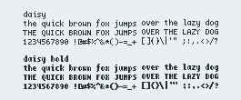

daisy
=====

BDF (Bitmap) font designed to be small but very readable. Glyphs are
5x8 pixels, plus an additional two pixels below. Includes a bold variant
at the same size as the non-bold.

Dependencies
------------

- make
- fonttosfnt (to compile the font)
- mkfontscale (to install the font)

Most UNIXes will have `make` pre-installed.  To install `bdftopcf` on macOS, run
`brew install xquartz`.  On Linux, use your distro's package manager.

Installation
------------

    make
    make install

This will install `daisy.otb` and `daisy_bold.otb` to `~/.local/share/fonts` by
default. To install elsewhere, set the FONTSDIR variable before
installing:

    FONTSDIR=/usr/local/share/fonts make install
