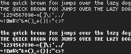

daisy
=====

BDF (Bitmap) font designed to be small but very readable. Glyphs are
5x8 pixels, plus an additional two pixels below. Includes a bold variant
at the same size as the non-bold.

Dependencies
------------

- make (for easy installation)

(Most UNIXes will have this pre-installed.)

Installation
------------

    make

This will install `daisy.bdf` and `daisy_bold.bdf` to `~/.fonts` by
default. To install elsewhere, set the FONTSDIR variable before
installing:

    FONTSDIR=/usr/local/share/fonts make
